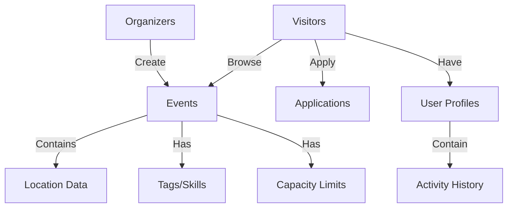
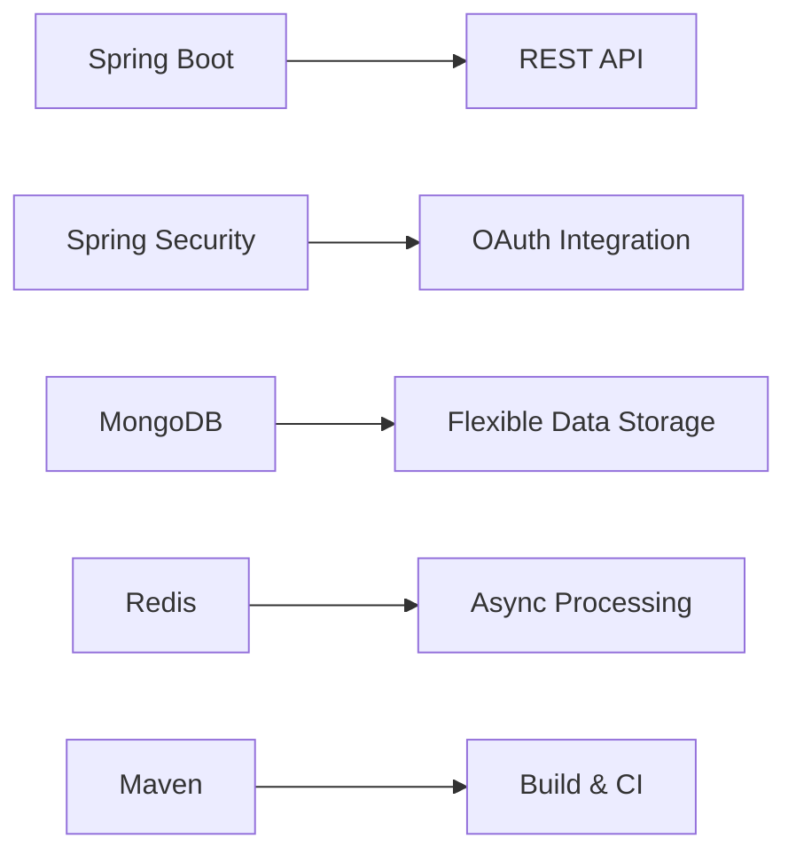
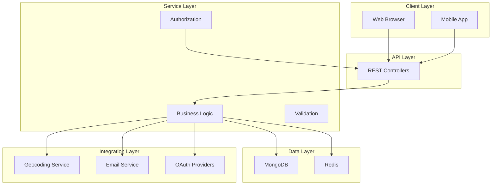

# Implify — Volunteer Events Platform (MVP)

A web application connecting organizers with volunteers through localized event discovery and management.

## Project Overview

Implify is a matchmaking platform that brings together organizations needing volunteers and people looking to help their communities. Our MVP provides the core functionality for event creation, discovery, and application management.



## Target Audience

**Organizers**: NGOs, student clubs, community groups  
**Volunteers**: Individuals seeking meaningful opportunities

## Core Features (MVP)

### Event Management
- Create and edit events with detailed information
- Address and geocoordinate support
- Tagging system for skills/needs
- Capacity and slot management

### Discovery & Matching
- Nearby event detection (user location or chosen area)
- Smart filtering by date, distance, and tags
- Map-based browsing interface

### User System
- GitHub OAuth authentication
- Basic profile management
- Activity history and tracking
- Application status tracking

## Technology Stack



| Layer | Technology | Purpose |
|-------|------------|---------|
| Backend | Spring Boot | REST API foundation |
| Security | Spring Security + OAuth | Authentication & authorization |
| Database | MongoDB | Flexible document storage |
| Async | Redis | Background processing |
| Build | Maven | Dependency management |

## Implementation Status

### Completed
- Base data models and REST endpoints
- Authentication scaffold (GitHub OAuth)
- Event CRUD operations
- Proximity-based search
- Basic filtering capabilities

### In Progress
- Application moderation system
- Email and push notifications
- User interface refinement
- Role management (organizer/volunteer)
- Enhanced event pages with maps

### Planned
- Interest-based recommendations
- Calendar integration (ICS)
- Social sharing and export
- Internationalization (i18n)
- Additional OAuth providers

## Architecture Overview



## Quick Start (Local Development)

### Prerequisites
- Java 17 or higher
- MongoDB 5.0+
- Redis 6.0+

### Installation Steps

1. Clone the repository
   ```bash
   git clone https://github.com/yakubka/Implify.git
   cd Implify
   ```

2. Configure environment variables
   ```bash
   # Create application.yml or set environment variables:
   export SPRING_DATA_MONGODB_URI=mongodb://localhost:27017/implify
   export SPRING_REDIS_HOST=localhost
   export SPRING_REDIS_PORT=6379
   export GITHUB_OAUTH_CLIENT_ID=your_github_client_id
   export GITHUB_OAUTH_CLIENT_SECRET=your_github_client_secret
   ```

3. Run the application
   ```bash
   mvn spring-boot:run
   ```

4. Access the application
   Open http://localhost:8080 in your browser


## Contributing

We welcome contributions to Implify. Please see our Contributing Guidelines for details on how to submit pull requests, report issues, or suggest new

## Support

If you encounter any problems or have questions, please check the existing GitHub Issues or create a new issue if your problem hasn't been reported.
